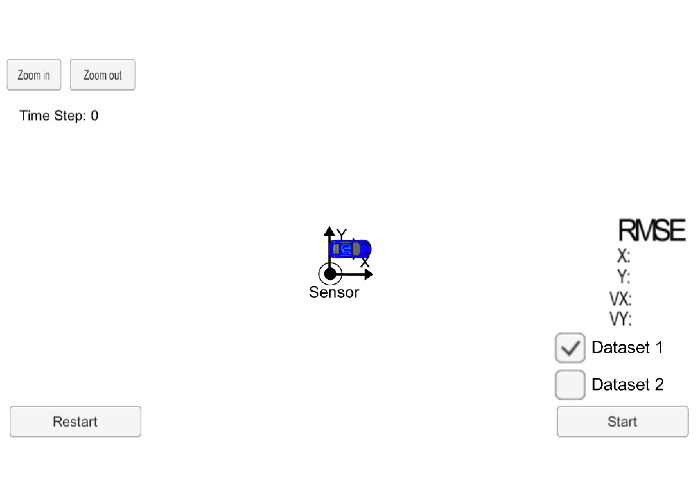
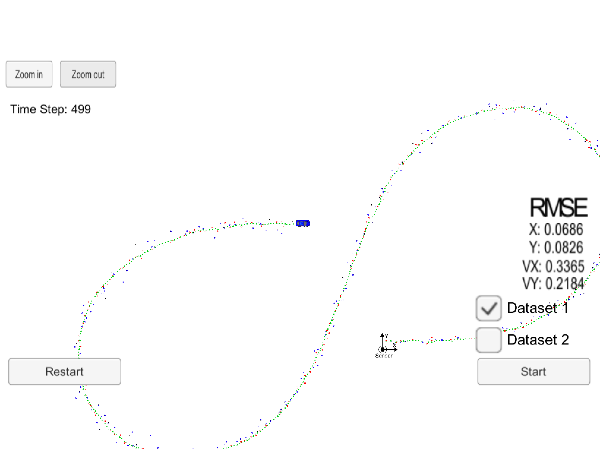
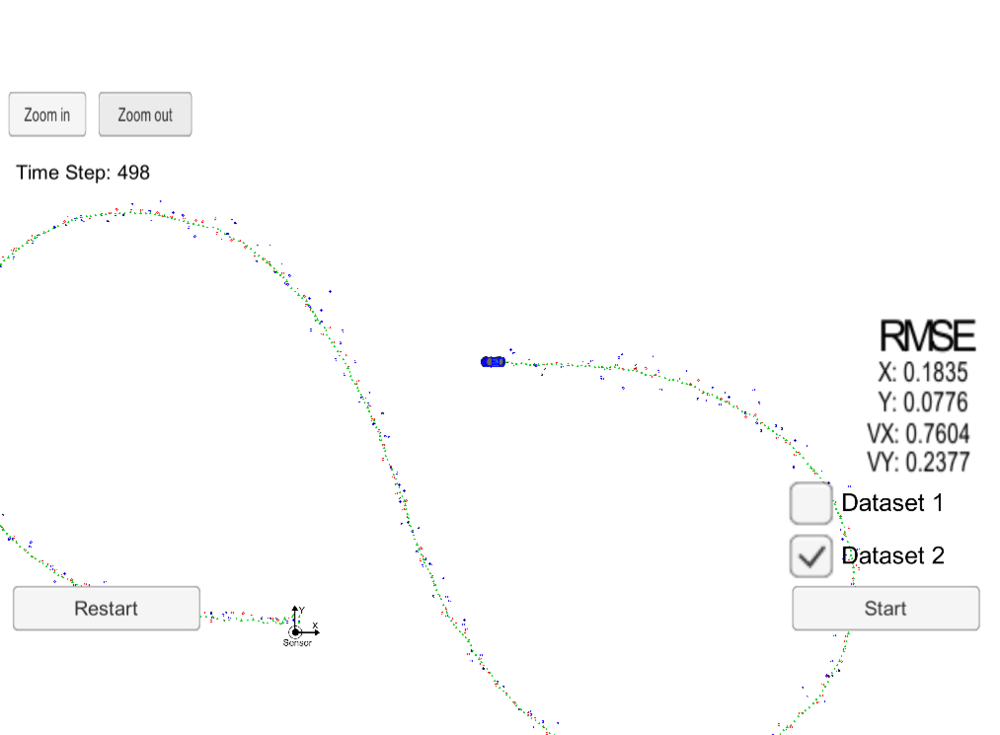
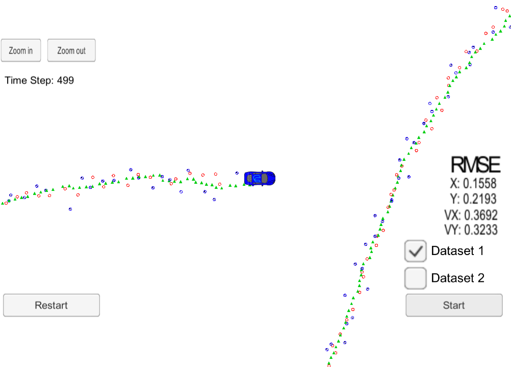
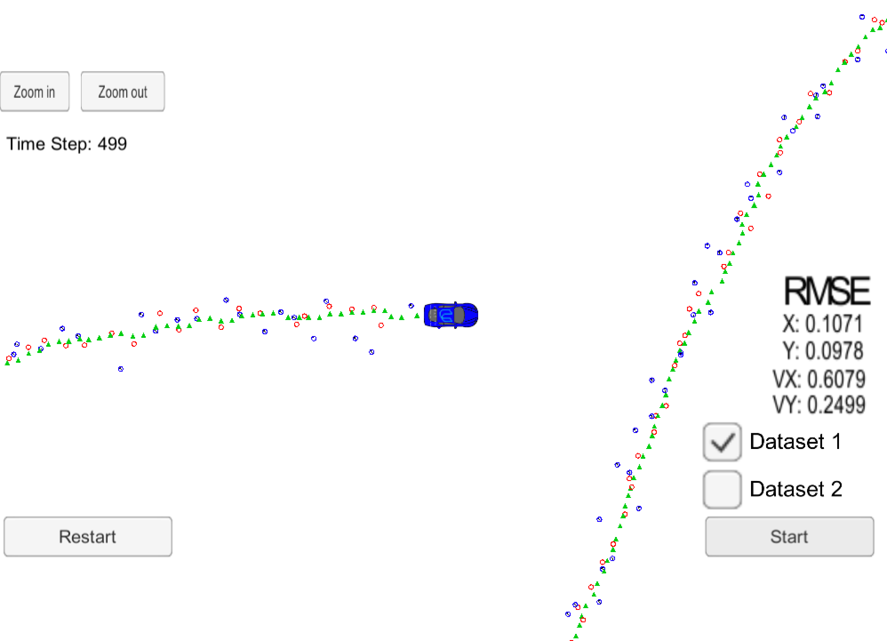

# CarND-Unscented-Kalman-Filter-Project
Self-Driving Car Engineer Nanodegree Program

In this project utilize an Unscented Kalman Filter to estimate the state of a moving object of interest with noisy lidar and radar measurements. Passing the project requires obtaining RMSE values that are lower that the tolerance outlined in the project rubric. So the values  px, py, vx, and vy RMSE should be less than or equal to the values [.09, .10, .40, .30].

This project involves the Term 2 Simulator which can be downloaded [here](https://github.com/udacity/self-driving-car-sim/releases)

Note that the programs that need to be written to accomplish the project are src/ukf.cpp, src/ukf.h, tools.cpp, and tools.h

The program main.cpp has already been filled out, but feel free to modify it.

Here is the main protcol that main.cpp uses for uWebSocketIO in communicating with the simulator.


INPUT: values provided by the simulator to the c++ program

["sensor_measurement"] => the measurment that the simulator observed (either lidar or radar)


OUTPUT: values provided by the c++ program to the simulator

["estimate_x"] <= kalman filter estimated position x
["estimate_y"] <= kalman filter estimated position y
["rmse_x"]
["rmse_y"]
["rmse_vx"]
["rmse_vy"]

## Basic Build Instructions

1. Clone this repo.
2. Make a build directory: `mkdir build && cd build`
3. Compile: `cmake .. && make`
4. Run it: `./UnscentedKF` Previous versions use i/o from text files.  The current state uses i/o
from the simulator.

## The project
You must open the simulator. Once is open you will see the main menu of the simulator.

You must select the project 1/2: EKF and UKF to enter the simulation.

Once open, from the build directory, execute `./UnscentedKF`. The output should be:

```
Listening to port 4567
Connected!!!
```

Then the program is connected to the simulator.

The following is an image of the simulator:



You must select the dataset and press Start.
Each time you want to restart, you must push the Restart button and close and open the app.

The simulator provides two datasets. The differences between them are:

- The direction the car (the object) is moving.
- The order the first measurement is sent to the UKF. On dataset 1, the LIDAR measurement is sent first. On the dataset 2, the RADAR measurement is sent first.

Here is the simulator final state after running the UKL with dataset 1:


As you can imagine, I have used the zoom out feature of the simulator to print the full path of the vehicle. 

Here is the simulator final state after running the UKL with dataset 2:



As you can see, the final RMSE for dataset 2 is worst than for dataset 1. Maybe it will be for the initization of the radar data.

After we know the result of both dataset we are going to center on the one with the best results, the first one.

We can disable any of the sensors using this code:

```
  // if this is false, laser measurements will be ignored (except during init)
  use_laser_ = false;

  // if this is false, radar measurements will be ignored (except during init)
  use_radar_ = true;
```

So in this case, we are disabling laser data, then we have: 


Where we obtain still worst results then for the second dataset.
- Dataset 1 : RMSE = [0.1558, 0.2193, 0.3692, 0.3233]

Then if we want to disable radar data:
```
  // if this is false, laser measurements will be ignored (except during init)
  use_laser_ = true;

  // if this is false, radar measurements will be ignored (except during init)
  use_radar_ = false;
```

Then we have: 


Where we obtain almost the same results than for the second dataset, but best than for only radar data.
- Dataset 1 : RMSE = [0.1071, 0.0978, 0.6079, 0.2499]

So it seems that Laser data its more accurate than radar data, but the fusion of both, its better than only one source of reference.

# [Rubric](https://review.udacity.com/#!/rubrics/783/view) points

## Compiling

### Your code should compile.

No modifications on CMakeList.txt were done in this project. It compiles without errors or warnings.

## Accuracy

### Your algorithm will be run against "obj_pose-laser-radar-synthetic-input.txt". We'll collect the positions that your algorithm outputs and compare them to ground truth data. Your px, py, vx, and vy RMSE should be less than or equal to the values [.09, .10, .40, .30].

The UKF accuracy was:

- Dataset 1 : RMSE = [0.0686, 0.0826, 0.3365, 0.2184]
- Dataset 2 : RMSE = [0.1835, 0.0776, 0.7604, 0.2377]

Since the reference file for the final accuracy test will be the same than for Dataset 1, this is under requirements. I will study why dataset 2 has worst behaviour.

## Following the Correct Algorithm

### Your Sensor Fusion algorithm follows the general processing flow as taught in the preceding lessons.

The UKF implementation could be found at [src/ukf.cpp](./src/ukf.cpp). On the [ProcessMeasurement](./src/ukf.cpp#L100) method, the [Prediction](./src/ukf.cpp#L137) is executed for the prediction step, and methods [UpdateRadar](./src/ukf.cpp#L227) and [UpdateLidar](./src/ukf.cpp#L253) are executed for the update step depending on the measurement type.

A new method double UKF::UpdateUKF, its developed as with the Kalman Filter project, to make the common calculations for both sensors, the output is the NIS of each one, so we can make something like:

```
NIS_radar_=UpdateUKF(meas_package, Zsig, n_z);
or
NIS_laser_=UpdateUKF(meas_package, Zsig, n_z);
```
### Your Kalman Filter algorithm handles the first measurements appropriately.

The first measurement is handled at [ProcessMeasurement](src/ukf.cpp#L103) from line 102 to line 119.

Previosly P_ has been defined in line 27 as:
```
P_ = MatrixXd::Identity(5, 5);
```

So later can be upgraded for each sensor, but this works well.

### Your Kalman Filter algorithm first predicts then updates.

The prediction step is implemented at [Prediction](./src/ukf.cpp#L137) method from line 137 to line 221.

### Your Kalman Filter can handle radar and lidar measurements.

Different type of measurements are handled in two places in [UKF class](src/ukf.cpp):

- For the first measurement from line 102 to line 119.
- For the update step from line 263 to line 317. 

The kind of code:
```
if (meas_package.sensor_type_ == MeasurementPackage::XX
```
it,s used, I would like to have used something more object oriented, but I still have to study more C++ to reach this goal.

## Content of this repo
- `scr`  a directory with the project code:
  - `main.cpp` - reads in data, calls a function to run the Kalman filter, calls a function to calculate RMSE
  - `ukf.cpp` - the UKF filter itself, defines the predict function, the update function for lidar, and the update function for radar
  - `tools.cpp` - a function to calculate RMSE